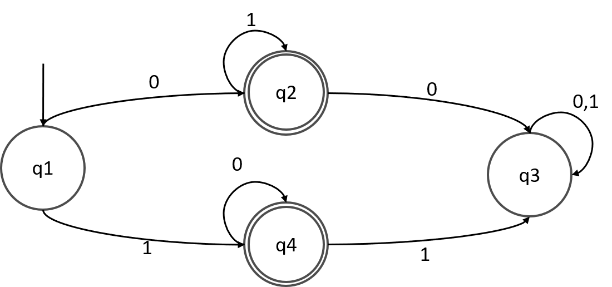

# 1. Instruction List
* $\epsilon$ is like [production rules](../Formal%20Grammar.md)
* Formula: $\epsilon(q_a, v) = q_b$ 
* where: 
    * $q_a$  is a state
    * $q_b$ is another state
    * v is in the [input alphabet](./DFA.md).
## Example
$$
\begin{aligned}
M1 &= (Q, \sum, \delta, q_1, F) \\
Q &= \set{q_1, q_2, q_3, q_4} \\
\sum &= \set{0, 1} \\
F &= \set{q_2, q_4}
\end{aligned}
$$
# 2. State Diagram
* States are encircled
* Arrows represent values
* initial states have arrows having no source
* Final states are encircled twice.

## Example
* 
    

    
    

# 3. Transition Table
* Truth table-like representation of a regular language.
* Example:
    | Q       | 0     | 1     |
    | ------- | ----- | ----- |
    | ->$q_1$ | $q_2$ | $q_4$ |
    | ($q_2$) | $q_3$ | $q_2$ |
    | $q_3$   | $q_3$ | $q_3$ |
    | ($q_4$) | $q_4$ | $q_3$ |
    * Note: () - final states are still encircled

## Usage
### Accepting Conditions
* Scan entire input string
* Land on a final state

### Example
* 01111
  * $q_1,0 \rightarrow q_2,1 \rightarrow q_2,1 \rightarrow q_2,1 \rightarrow q_2$
 * $\therefore$ __accepted__
* 1001
  * $q_1,1 \rightarrow q_4,0 \rightarrow q_4, 0 -> q3$
  * $\therefore$ __rejected__ - $q_3$ is not a final state.

## Design
| Regular Expression | Machine                   |
| ------------------ | ------------------------- |
| a                  | $(q_1) \rightarrow (q_2)$ |
| a*                 | Loop                      |
| a+                 | arrow then loop           |
| a,b                | Multiple arrows           |
| ab                 | two arrows                |
### Note: 
* Every state must only have 1 transition for each alphabet.
### Trap State
* State that catches all non-members of the language
* Allows the string to be read even if it is unaccepted.
